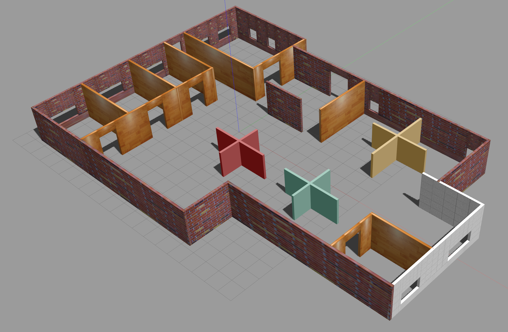

# RND-Project1
Project1 Gazebo basics - Udacity Robotics Nanodegree

*Run Notes: 
set-gazebo_plugin_path.sh contains the path to be exported for the plugin
set_model_path.sh sets the model path for Gazebo 7.0 since it does not give you the ability to do this in the GUI.*

## Submission outline

### 1. Build a single floor wall structure using the Building Editor
Here I built a small office using the building editor.

### 2. Model any object of your choice using the Model Editor
I decided to extend the robot from the online tutorial for my model.

### 3. Import your structure and two instances of your model
My world file is located in the `world` folder - `project-world`.

### 4. Import at least one model from the Gazebo online library
Here is the world with the model and imports.

### 5. Write a C++ World Plugin to interact with your world
The plugin is located in the `script` folder. Here is the output.
